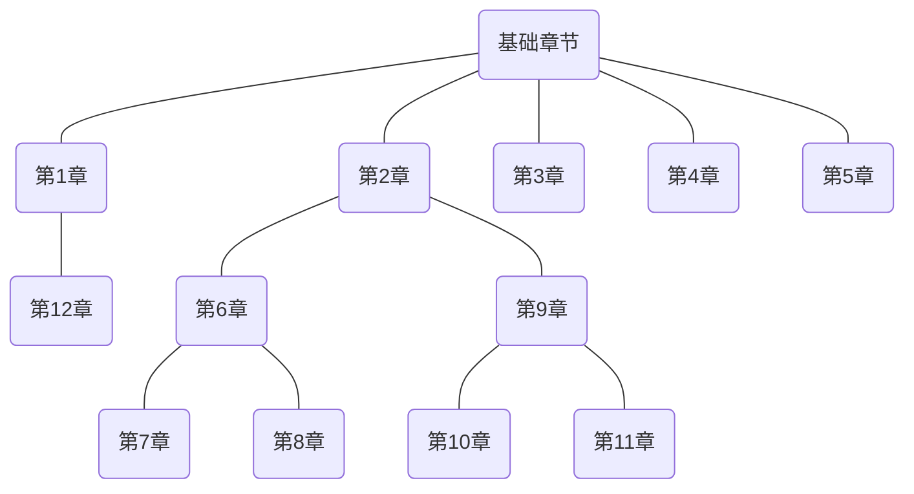

# DiscreteMath
《离散数学及其应用》学习笔记

[我的CSDN博客地址](https://blog.csdn.net/YQXLLWY)

在这里主要介绍一下各个章节，以及其关联性。

## 第1章：基础：逻辑和证明

这一章节很基础，比较麻烦的就是名词一堆。

从内容上来说，都是很浅显易懂的部分，如果你按照它的思路去解释那些句子，就会理解起来比较简单一点。

从关联性来讲，这一章在后面的比重不是很多，除了用来说明一些定理之外，不会有推导的部分。

和12章的布尔代数的概念是类似的。

## 第2章：基本结构：集合，函数，序列，求和与矩阵

这部分也是内容上比较简单，就是又是一堆名词，但是其中的知识都是很浅显易懂的。

从关联性上来说，这一章也算是基础，后面很多地方会用到这里的名词，所以还是不太适合跳过。

## 第3章：算法

这一章就是一个很单独的模块，时间复杂度和空间复杂度，建议去找其他视频来看。

关联性上来说，这一章其实蛮单独的。

## 第4章：数论与密码学

这一章和其他章节关联性不强，很独立，但是建议从开始一小节一小节的往后看，不要跳过，否则很容易后面看不懂。

如果不想看，直接跳过也可以，后面基本没有用到这一块的内容。

## 第5章：归纳和递归

这一章很简单，弄懂含义就可以了，不需要仔细看。

而且后面很多证明都需要这里的内容，所以还是需要了解一下。

## 第6章：计数

这一章是基础！！！一定要仔细看，否则后面很多章节都会看不懂。

至于内容上，老老实实按照按照它的思路走下去，一定要提前理解它试图解决的问题是什么，对应的解决方案是什么，就可以理解其中的内容了。

## 第7章：离散概率

在第6章的基础之上，加上概率的部分，本质上没有跳出第6章的范畴。

## 第8章：高级计数技术

和第6章相呼应，简单来说就是考虑的情况更加复杂，如果你第6章没问题，这一章照着它的思路走下去也不会有问题。

## 第9章：关系

这个有点关系型数据库的设计思路都不会有问题。

而且这一章的一些概念在后面图，树部分也有用到，所以需要认真看一下。

## 第10章：图

超级简单的概念介绍，复杂一点的是后面部分，前几章就是一些基本概念介绍，后面部分考虑的情况复杂一点，不过也不是需要你去解决，看他解决的方式就可以了。

## 第11章：树

内容安排上和第10章图一样，其中后面部分建议参考其他视频，动态讲解起来可能更加便于理解。

## 第12章：布尔代数

其中需要注意的就是后面部分的化简电路和设计电路，前面部分就是将第1章的概念用布尔代数的名词解释一遍而已。

## 第13章：计算模型

天书，看不懂，直接放弃。而且感觉和其他各个章节都是独立的。

这里整理一下其中各个部分的关联：

